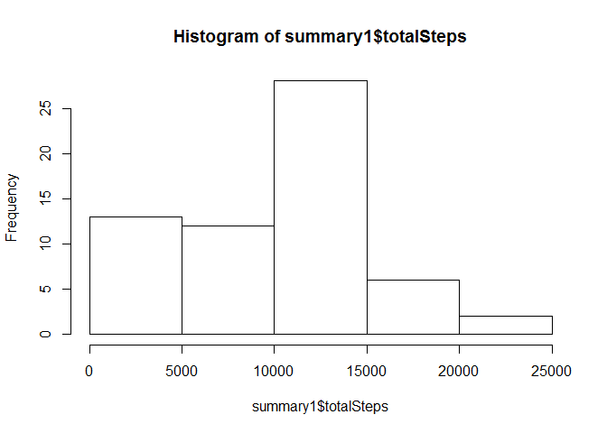
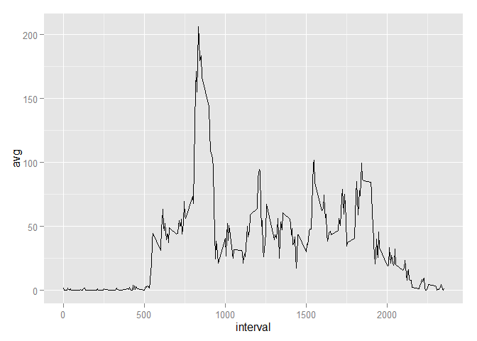
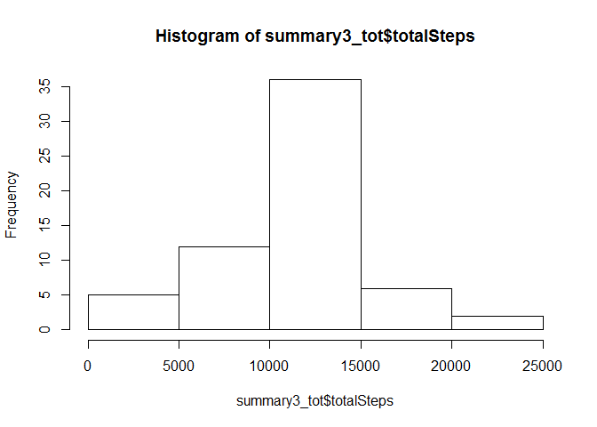
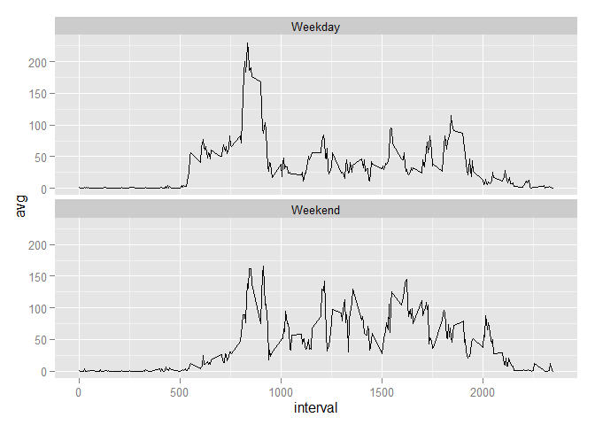

# Reproducible Research: Peer Assessment 1


## Loading and preprocessing the data


```r
library("ggplot2");
library(plyr);

rawdata<-read.csv("activity.csv",header=T)

summary1<-ddply(rawdata,c("date"),summarise
               ,totalSteps=sum(steps,na.rm=TRUE)
)
```


## What is mean total number of steps taken per day?

###Make a histogram of the total number of steps taken each day


```r
hist(summary1$totalSteps)
```

 

###Calculate and report the mean and median total number of steps taken per day

```r
mean(summary1$totalSteps)
```

```
## [1] 9354.23
```

```r
median(summary1$totalSteps)
```

```
## [1] 10395
```


## What is the average daily activity pattern?

### Make a time series plot (i.e. type = "l") of the 5-minute interval (x-axis) and the average number of steps taken, averaged across all days (y-axis)


```r
summary2<-ddply(rawdata,c("interval"),summarise
                ,avg=mean(steps,na.rm=TRUE))

ggplot(summary2,aes(x=interval,y=avg)) + geom_line()
```

 


### Which 5-minute interval, on average across all the days in the dataset, contains the maximum number of steps?

```r
summary2[which.max(summary2[,2]),]
```

```
##     interval      avg
## 104      835 206.1698
```

## Imputing missing values
###Calculate and report the total number of missing values in the dataset (i.e. the total number of rows with NAs)


```r
count(is.na(rawdata$steps))
```

```
##       x  freq
## 1 FALSE 15264
## 2  TRUE  2304
```
###Create a new dataset that is equal to the original dataset but with the missing data filled in.


```r
summary3<-rawdata
```


###the fixed data is the average for that 5 minute interval across all days

```r
summary3$fixed<-ifelse(is.na(rawdata$steps),summary2$avg,rawdata$steps)
```
###Make a histogram of the total number of steps taken each day

```r
summary3_tot<-ddply(summary3,c("date"),summarise
                ,totalSteps=sum(fixed)
)

hist(summary3_tot$totalSteps)
```

 

###Calculate and report the mean and median total number of steps taken per day

```r
mean(summary3_tot$totalSteps)
```

```
## [1] 10766.19
```

```r
median(summary3_tot$totalSteps)
```

```
## [1] 10766.19
```

## Are there differences in activity patterns between weekdays and weekends?

###Create a new factor variable in the dataset with two levels – “weekday” and “weekend” indicating whether a given date is a weekday or weekend day.


```r
summary3$weekday<-weekdays(strptime(summary3$date,"%Y-%m-%d"))
summary3$WDtype<-as.factor(ifelse(summary3$weekday=="Saturday" | summary3$weekday=="Sunday","Weekend","Weekday"))
```

##Make a panel plot containing a time series plot (i.e. type = "l") of the 5-minute interval (x-axis) and the average number of steps taken, averaged across all weekday days or weekend days (y-axis). 

```r
summary4<-ddply(summary3,c("WDtype","interval"),summarise
                ,avg=mean(fixed))
ggplot(summary4,aes(x=interval,y=avg)) + geom_line()+ facet_wrap(~WDtype,ncol=1)
```

 

